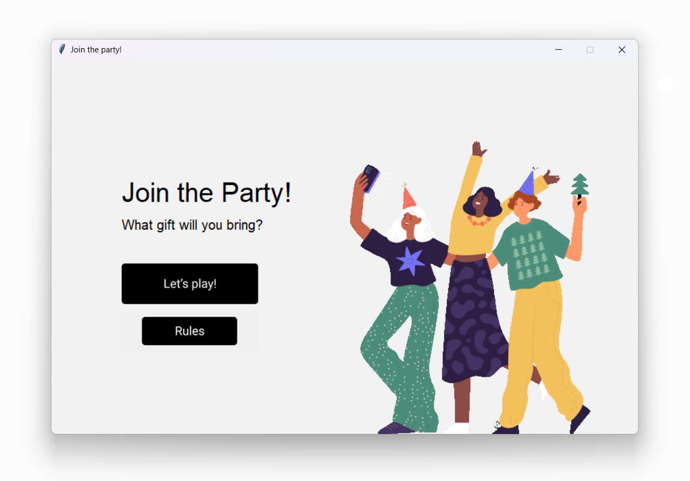
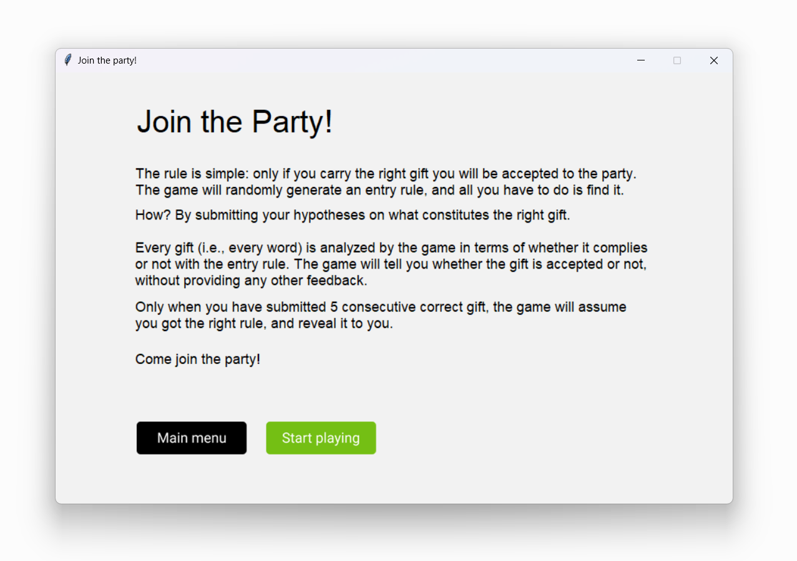
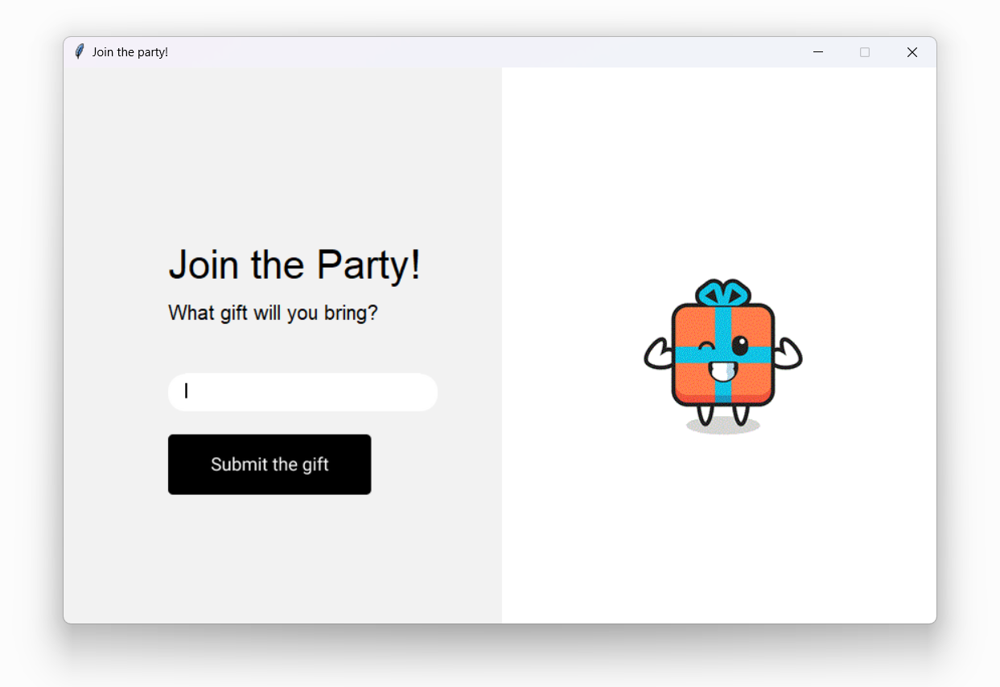
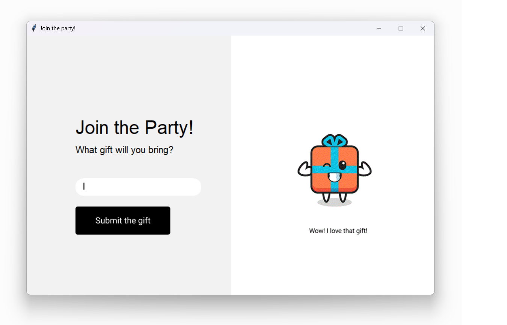
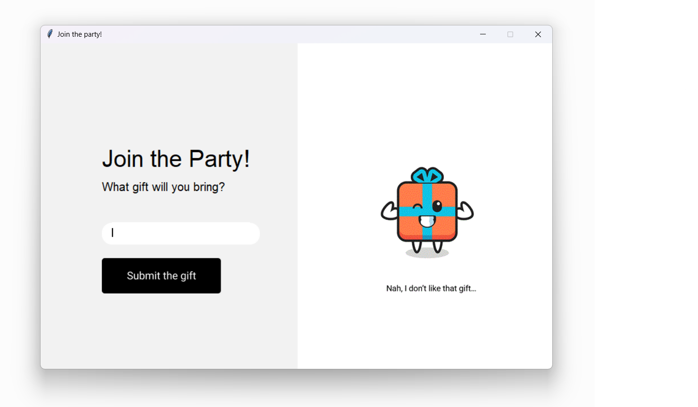

## Introduction

Welcome to a world where festivities await, but only the astute can step through the threshold. Introducing 'Join the Party' - a game that combines wit, intuition, and a touch of mystery to guarantee a celebration like no other.

The premise is simple: you hold an invitation in the form of a gift, but not just any gift will grant you access. Hidden within the game's algorithms lies the secret 'entry rule'. Your task? To decipher it.

Each gift, each word, is meticulously scrutinized by the game, analyzed against the enigmatic criterion. With bated breath, you submit your hypothesis, waiting for the game's verdict. Will it be acceptance, or will the anticipation linger a little longer?

But patience is a virtue, and success here requires more than just chance. You must string together five consecutive correct gifts, proving that you hold the key to the party's heart. It's a journey of trial and triumph, where every rejected gift inches you closer to revelation.

So, seekers of celebration, it's time to put on your thinking caps and delve into the riddle. 'Join the Party' promises an experience where each attempt is a step towards unlocking the festivities. Are you ready to embrace the challenge and discover the hidden rule that will lead you to the heart of the revelry?

Come, join the party, and let the games begin!

##### Packages deployed

+ Random
+ Tkinter
+ Figma

##### Next improvements

I plan to keep working on the code as I dive deeper in my learning journey. More specifically, I'd like to carry out the following updates:

+ Three levels of difficulty: easy, medium, hard, maybe based on the number of 'entry rules' allowed for each level.
+ General GUI improvements.
+ General refactoring of the code.

---

## Screenshots







## Python code

```
# This file was generated by the Tkinter Designer by Parth Jadhav
# https://github.com/ParthJadhav/Tkinter-Designer
########## PACKAGES ############

import string
import tkinter as tk
from tkinter import ttk
import random
from tkinter import messagebox

from pathlib import Path
from tkinter import *
# Explicit imports to satisfy Flake8
from tkinter import Tk, Canvas, Entry, Text, Button, PhotoImage

OUTPUT_PATH = Path(__file__).parent
ASSETS_PATH = OUTPUT_PATH / Path(r"C:\Users\tomma\Py projects\Guess the Gift\figma_interface\build\assets\frame0")
#img = ImageTk.PhotoImage(Image.open(Path(r"C:\Users\tomma\Py projects\Guess the Gift\figma_interface\build\assets\newyear-party-people-friends-5691982.png")))

########## GLOBAL VARIABLES #########
guess_number = 1
right_words = []
right_number = 0
game_chosen = 0
value = 0
happy_gifts = ['1.gif', '2.gif', '3.gif', '4.gif', '5.gif']
sad_gifts = ['6.gif', '7.gif', '8.gif', '9.gif', '10.gif']
photo_path = ''


######## VARIABLES FOR RANDOM INDEX CHARACTER ########
alphabet = list(string.ascii_lowercase) + list(string.ascii_uppercase)
random_letter = random.choice(string.ascii_lowercase)
random_index = random.choice([0,1,2,3,4,5,-1])


######## VARIABLES FOR RANDOM LENGHT OF WORD ########
random_word_lenght = random.choice(range(2,8))


###################################################################################################################
############################## R U L E S #########################################################################

def first_instance():
    def relative_to_assets(path: str) -> Path:
        return ASSETS_PATH / Path(path)
    game_window = Tk()
    game_window.title('Join the party!')
    game_window.geometry("868x554")
    game_window.configure(bg = "#FFFFFF")

    image_path = relative_to_assets("party.gif")  # Replace with your GIF file path
    img = PhotoImage(file=image_path)


    canvas2 = Canvas(
        game_window,
        bg = "#FFFFFF",
        height = 554,
        width = 868,
        bd = 0,
        highlightthickness = 0,
        relief = "ridge"
    )

    canvas2.place(x = 0, y = 0)
    canvas2.create_rectangle(
        0.0,
        0.0,
        868.0,
        554.0,
        fill="#F2F2F2",
        outline="")

    canvas2.create_image(
        860.0,  # X-coordinate where you want to place the image
        580.0,  # Y-coordinate where you want to place the image
        image=img,
        anchor="se"  # Anchor point for the image (center in this case)
    )

    canvas2.create_text(
        104.0,
        232.0,
        anchor="nw",
        text="What gift will you bring?",
        fill="#000000",
        font=("Roboto", 20 * -1)
    )

    canvas2.create_text(
        104.0,
        174.0,
        anchor="nw",
        text="Join the Party!",
        fill="#000000",
        font=("Roboto Medium", 40 * -1)
    )

    button_image_3 = PhotoImage(
        file="rules_button.png")
    rules_button = Button(
        image=button_image_3,
        borderwidth=0,
        highlightthickness=0,
        command= lambda: [game_window.destroy(),rules()],
        relief="flat"
    )
    rules_button.place(
        x=104.0,
        y=371.0,
        width=202.36407470703125,
        height=60.0
    )

    button_image_2 = PhotoImage(
        file=relative_to_assets("button_1.png"))
    button_2 = Button(
        image=button_image_2,
        borderwidth=0,
        highlightthickness=0,
        command=lambda: [game_window.destroy(),playing()],
        relief="flat"
    )
    button_2.place(
        x=104.0,
        y=301.0,
        width=202.36407470703125,
        height=60.0
    )
    game_window.resizable(False, False)


    game_window.mainloop()


def rules():
    OUTPUT_PATH = Path(__file__).parent
    ASSETS_PATH = OUTPUT_PATH / Path(r"C:\Users\tomma\Py projects\Guess the Gift\rules_interface\build\build\assets\frame0")


    def relative_to_assets(path: str) -> Path:
        return ASSETS_PATH / Path(path)


    windowi = Tk()
    windowi.title('Join the party!')
    windowi.geometry("868x554")
    windowi.configure(bg = "#FFFFFF")


    canvas = Canvas(
        windowi,
        bg = "#FFFFFF",
        height = 554,
        width = 868,
        bd = 0,
        highlightthickness = 0,
        relief = "ridge"
    )

    canvas.place(x = 0, y = 0)
    canvas.create_rectangle(
        0.0,
        0.0,
        868.0,
        554.0,
        fill="#F2F2F2",
        outline="")

    canvas.create_text(
        104.0,
        41.0,
        anchor="nw",
        text="Join the Party!",
        fill="#000000",
        font=("Roboto Medium", 40 * -1)
    )

    button_image_1 = PhotoImage(
        file=relative_to_assets("button_1.png"))
    button_1 = Button(
        image=button_image_1,
        borderwidth=0,
        highlightthickness=0,
        command=lambda: [windowi.destroy(),first_instance(), print('main_menu_clicked')],
        relief="flat"
    )
    button_1.place(
        x=104.0,
        y=448.0,
        width=141.3640594482422,
        height=41.913787841796875
    )

    button_image_2 = PhotoImage(
        file=relative_to_assets("button_2.png"))
    button_2 = Button(
        image=button_image_2,
        borderwidth=0,
        highlightthickness=0,
        command= lambda:[windowi.destroy(),playing()],
        relief="flat"
    )
    button_2.place(
        x=270.0,
        y=448.0,
        width=141.36407470703125,
        height=41.913787841796875
    )

    canvas.create_text(
        102.0,
        119.0,
        anchor="nw",
        text="The rule is simple: only if you carry the right gift you will be accepted to the party.",
        fill="#000000",
        font=("Roboto", 18 * -1)
    )

    canvas.create_text(
        102.0,
        140.0,
        anchor="nw",
        text="The game will randomly generate an entry rule, and all you have to do is find it.",
        fill="#000000",
        font=("Roboto", 18 * -1)
    )

    canvas.create_text(
        102.0,
        172.0,
        anchor="nw",
        text="How? By submitting your hypotheses on what constitutes the right gift.",
        fill="#000000",
        font=("Roboto", 18 * -1)
    )

    canvas.create_text(
        102.0,
        357.0,
        anchor="nw",
        text="Come join the party!",
        fill="#000000",
        font=("Roboto", 18 * -1)
    )

    canvas.create_text(
        102.0,
        290.0,
        anchor="nw",
        text="Only when you have submitted 5 consecutive correct gift, the game will assume",
        fill="#000000",
        font=("Roboto", 18 * -1)
    )

    canvas.create_text(
        102.0,
        311.0,
        anchor="nw",
        text="you got the right rule, and reveal it to you.",
        fill="#000000",
        font=("Roboto", 18 * -1)
    )

    canvas.create_text(
        102.0,
        256.0,
        anchor="nw",
        text="without providing any other feedback.",
        fill="#000000",
        font=("Roboto", 18 * -1)
    )

    canvas.create_text(
        102.0,
        214.0,
        anchor="nw",
        text="Every gift (i.e., every word) is analyzed by the game in terms of whether it complies",
        fill="#000000",
        font=("Roboto", 18 * -1)
    )

    canvas.create_text(
        102.0,
        235.0,
        anchor="nw",
        text="or not with the entry rule. The game will tell you whether the gift is accepted or not,",
        fill="#000000",
        font=("Roboto", 18 * -1)
    )
    windowi.resizable(False, False)
    windowi.mainloop()


###################################################################################################################
###########################   SECOND INTERFACE ###################################################################

def playing():
    print('clicked')
    
    OUTPUT_PATH = Path(__file__).parent
    ASSETS_PATH = OUTPUT_PATH / Path(r"C:\Users\tomma\Py projects\Guess the Gift\second interface\build\build\assets\frame0")

    def relative_to_assets(path: str) -> Path:
        return ASSETS_PATH / Path(path)


    window = Tk()
    window.title('Join the party!')
    window.geometry("868x554")
    window.configure(bg = "#FFFFFF")

    yay = PhotoImage(file='yay.gif')
    nah = PhotoImage(file='nah.gif')

    ######## GUI FEEDBACKS #####

    def show_message():
        question = messagebox.showinfo(title="Congrats!",message=f'Congrats! You had to find words having the letter "{random_letter}" at the position number {random_index+1}, you got it and you may now join the party!')

    def show_message_menouno():
        question = messagebox.showinfo(title="Congrats!",message=f'Congrats! You had to find words having the letter "{random_letter}" as the last letter, you got it and you may now join the party!')

    def cheating_message():
        issue = messagebox.showinfo(title="Warning!",message=f'Are you trying to cheat? You already used the word "{attempt.get()}", submit a different word.')

    def solution_message_random_letter_at_random_place():
        solution = messagebox.askquestion('Getting tired?', "You have been waiting at the party's door for a long time, do you want to know the solution?",
                                            icon='warning')
        if solution == "yes":
            if random_index == -1:
                messagebox.showinfo(title="Congrats!",message=f'Congrats! You had to find words having the letter "{random_letter}" as the last letter, you got it and you may now join the party!')
            else:
                messagebox.showinfo(title="Solution", message=f'You had to find words having the letter "{random_letter}" at the position number {random_index+1}')
            root.destroy()

    def invalid_input():
        invalid_inpu = messagebox.showinfo(title="Warning!",message="Invalid input, try again.")

    def warning_random_lenght_of_words():
        issue = messagebox.showinfo(title="Warning!",message=f"The word has at least {random_index-1} letters.")

    def solution_random_lenght_of_words():
        solution = messagebox.askquestion('Getting tired?', "You have been waiting at the party's door for a long time, do you want to know the solution?",
                                            icon='warning')
        if solution == "yes":
            messagebox.showinfo(title="Solution", message=f'You had to find words of {random_word_lenght} characters.')
            window.destroy()

    def congrats_random_lenght_of_words():
        question = messagebox.showinfo(title="Congrats!",message=f'Congrats! You had to find words of {random_word_lenght} characters, you got it and you may now join the party!')

    def solution_initial_letter():
        question = messagebox.askquestion('Getting tired?', "You have been waiting at the party's door for a long time, do you want to know the solution?",
                                        icon='warning')
        if question == "yes":
            messagebox.showinfo(title="Solution",message=f"You had to find words having the letter {random_letter} as the initial letter")
            window.destroy()

    def congrats_initial_letter():
        messagebox.showinfo(title='Congrats!',message=f"Congrats! You had to find words having the letter {random_letter} as the initial letter, you got it and now you can join the party!")

    def reset_wigets():
        for widget in window.winfo_children:
            if isinstance(widget,tk.Entry):
                widget.delete(0,'end')
            if isinstance(widget, tk.StringVar):
                widget.set("")
            if isinstance(widget, tk.Label):
                widget.grid_forget()
            if isinstance(widget, tk.Text):
                widget.delete('1.0', tk.END)
            window.grid(column=1,row=0)

    ############################ GAME LOGIC ################################
    def random_letter_at_random_place():
        global guess_number
        global happy_gifts
        global sad_gifts
        
        
        photo = PhotoImage(file=photo_path)

        def check_input(word):
            global right_number
            global photo_path
            global canvas_image
            input_word = word
            if input_word[random_index].lower() == random_letter:
                if input_word in right_words:
                    cheating_message()
                    right_number += -1
                else:
                    value = random.randint(0,5)
                    if value <= 5:
                        photo_path = random.choice(happy_gifts)
                    else:
                        photo_path = random.choice(sad_gifts)
                    canvas.create_image(
                            745.0,  # X-coordinate where you want to place the image
                            430.0,  # Y-coordinate where you want to place the image
                            image=yay,
                            anchor="se"  # Anchor point for the image (center in this case)
                        )
                    right_words.append(input_word)
                    print("correct")
                right_number += 1
                print(True)
            else:
                print(False)
                value = random.randint(6,10)
                
                #nah = PhotoImage(file=str(value)+'.gif')
                canvas.create_image(
                        745.0,  # X-coordinate where you want to place the image
                        430.0,  # Y-coordinate where you want to place the image
                        image=nah,
                        anchor="se"  # Anchor point for the image (center in this case)
                    )
        print(attempt.get())
        print(random_index)

        def check_word_lenght(word):
            if len(word) > random_index:
                print("len word is "+str(len(word))+" and the index is "+str(random_index))
                check_input(word)
            else:
                invalid_input() 

        #if random_index == -1:
        #    print("Try to solve the puzzle")
        #elif random_index <= 3:
        #    print("The word has at least a couple of letters")
        #else:
        #    print(f"The word has at least {random_index-1} letters.")

        if guess_number > 0:
            word = attempt.get()
            check_word_lenght(word)
            guess_number += 1
            print(random_index)
            print(random_letter)
            if right_number >= 5:
                if random_index == -1:
                    show_message_menouno()
                else:
                    show_message()
            if guess_number >= 10 and right_number <= 5:
                solution_message_random_letter_at_random_place()
            entry_1.delete(0, END) 
            entry_1.focus()

    def random_lenght_of_word():
        global guess_number

        def check_word_lenght(word):
            if len(word) < random_word_lenght:
                invalid_input()
            else:
                check_input(word)

        def check_input(word):
            global right_number
            input_word = word
            if len(input_word) == random_word_lenght:
                if input_word in right_words:
                    cheating_message()
                    right_number += -1
                else:
                    canvas.create_image(
                            745.0,  # X-coordinate where you want to place the image
                            430.0,  # Y-coordinate where you want to place the image
                            image=yay,
                            anchor="se"  # Anchor point for the image (center in this case)
                        )
                    right_words.append(input_word)
                right_number += 1
                print(True)
            else:
                print(False)
                canvas.create_image(
                        745.0,  # X-coordinate where you want to place the image
                        430.0,  # Y-coordinate where you want to place the image
                        image=nah,
                        anchor="se"  # Anchor point for the image (center in this case)
                    )

        if random_word_lenght == 2 and len(attempt.get()) < 2:
            warning_random_lenght_of_words()

        if guess_number > 0:
            word = attempt.get()
            check_word_lenght(word)
            guess_number += 1
            print(random_word_lenght)
            if right_number >= 5:
                congrats_random_lenght_of_words()
            if guess_number >= 10 and right_number <= 5:
                solution_random_lenght_of_words()
            entry_1.delete(0, END) 
            entry_1.focus()

    def initial_letter():
        global random_letter
        global guess_number

        def check_input(word):
            global right_number
            input_word = word
            if input_word[0].lower() == random_letter:
                if input_word in right_words:
                    cheating_message()
                    right_number += -1
                else:
                    right_words.append(input_word)
                    canvas.create_image(
                            745.0,  # X-coordinate where you want to place the image
                            430.0,  # Y-coordinate where you want to place the image
                            image=yay,
                            anchor="se"  # Anchor point for the image (center in this case)
                        )
                right_number += 1
                print(True)
            else:
                print(False)
                canvas.create_image(
                        745.0,  # X-coordinate where you want to place the image
                        430.0,  # Y-coordinate where you want to place the image
                        image=nah,
                        anchor="se"  # Anchor point for the image (center in this case)
                    )

        if guess_number > 0:
            word = attempt.get()
            check_input(word)
            guess_number += 1
            print(random_letter)
            if right_number >= 5:
                congrats_initial_letter()
            if guess_number >= 10 and right_number != 5:
                solution_initial_letter()
            entry_1.delete(0, END)
            entry_1.focus()
        
    list_of_functions = [3]
    game_chosen = random.choice(list_of_functions)

    def random_function():
        if game_chosen == 1:
            print("random letter at random place")
            return random_letter_at_random_place()
        if game_chosen == 2:
            print("random length of word")
            return random_lenght_of_word()
        if game_chosen == 3:
            print("random initial letter")
            return initial_letter()


    #### Buttons and fields Game page ####
    entry_guess = ""
    attempt = StringVar()

    congrats = ttk.Button(window,text=f"\n Congrats! You got the rule and you may come in!", command=show_message)
    text_widget = Text(window, height=10, width=40)


    


    #image_path = ("happy gift3.gif")  # Replace with your GIF file path
    

    canvas = Canvas(
        window,
        bg = "#FFFFFF",
        height = 554,
        width = 868,
        bd = 0,
        highlightthickness = 0,
        relief = "ridge"
    )

    canvas.place(x = 0, y = 0)


    canvas.create_rectangle(
        0.0,
        0.0,
        868.0,
        554.0,
        fill="#F2F2F2",
        outline="")

    canvas.create_rectangle(
        436.0,
        0.0,
        868.0,
        554.0,
        fill="#FFFFFF",
        outline="")

    image_path = 'intro.gif'

    img = PhotoImage(file=image_path)
    
    canvas_image = canvas.create_image(
        800.0,  # X-coordinate where you want to place the image
        430.0,  # Y-coordinate where you want to place the image
        image=img,
        anchor="se"  # Anchor point for the image (center in this case)
    )

    canvas_image
    
    canvas.create_text(
        104.0,
        232.0,
        anchor="nw",
        text="What gift will you bring?",
        fill="#000000",
        font=("Roboto", 20 * -1)
    )

    canvas.create_text(
        104.0,
        174.0,
        anchor="nw",
        text="Join the Party!",
        fill="#000000",
        font=("Roboto Medium", 40 * -1)
    )


    button_image_1 = PhotoImage(
        file="button_2.png")
    button_1 = Button(
        image=button_image_1,
        borderwidth=0,
        highlightthickness=0,
        command= random_function,
        relief="flat"
    )
    button_1.place(
        x=104.0,
        y=365.0,
        width=202.36407470703125,
        height=60.0
    )
    
    entry_image_1 = PhotoImage(
        file="entry_2.png")
    entry_bg_1 = canvas.create_image(
        238.0,
        322.5,
        image=entry_image_1
    )
    entry_1 = Entry(
        bd=0,
        textvariable=attempt,
        bg="#FFFFFF",
        fg="#000716",
        highlightthickness=0
    )
    entry_1.focus()
    entry_1.place(
        x=121.0,
        y=304.0,
        width=234.0,
        height=35.0
    )

    window.resizable(False, False)
    window.mainloop()


#######################################################################################################################
#########################   FIRST INTERFACE ########################################################################


def relative_to_assets(path: str) -> Path:
    return ASSETS_PATH / Path(path)


game_window = Tk()
game_window.title('Join the party!')
game_window.geometry("868x554")
game_window.configure(bg = "#FFFFFF")

image_path = relative_to_assets("party.gif")  # Replace with your GIF file path
img = PhotoImage(file=image_path)


canvas2 = Canvas(
    game_window,
    bg = "#FFFFFF",
    height = 554,
    width = 868,
    bd = 0,
    highlightthickness = 0,
    relief = "ridge"
)

canvas2.place(x = 0, y = 0)
canvas2.create_rectangle(
    0.0,
    0.0,
    868.0,
    554.0,
    fill="#F2F2F2",
    outline="")

canvas2.create_image(
    860.0,  # X-coordinate where you want to place the image
    580.0,  # Y-coordinate where you want to place the image
    image=img,
    anchor="se"  # Anchor point for the image (center in this case)
)

canvas2.create_text(
    104.0,
    232.0,
    anchor="nw",
    text="What gift will you bring?",
    fill="#000000",
    font=("Roboto", 20 * -1)
)

canvas2.create_text(
    104.0,
    174.0,
    anchor="nw",
    text="Join the Party!",
    fill="#000000",
    font=("Roboto Medium", 40 * -1)
)

button_image_3 = PhotoImage(
    file="rules_button.png")
rules_button = Button(
    image=button_image_3,
    borderwidth=0,
    highlightthickness=0,
    command= lambda: [game_window.destroy(),rules()],
    relief="flat"
)
rules_button.place(
    x=104.0,
    y=371.0,
    width=202.36407470703125,
    height=60.0
)

button_image_2 = PhotoImage(
    file=relative_to_assets("button_1.png"))
button_2 = Button(
    image=button_image_2,
    borderwidth=0,
    highlightthickness=0,
    command=lambda: [game_window.destroy(),playing()],
    relief="flat"
)
button_2.place(
    x=104.0,
    y=301.0,
    width=202.36407470703125,
    height=60.0
)
game_window.resizable(False, False)


game_window.mainloop()
```

